# Movie Recommendation Data Pipeline

## Introduction

As a Udacity Data Engineering Nanodegree Capstone project, I built a data pipeline for movie recommendation ML algorithms. I aimed to create a data model design which makes the data clean and ready-to-explore business-wise. 

In the project, five datasets are examined and two of them are used. Data cleaning is made on EMR by using Apache Spark. After data cleaning step, the data is stored in Amazon Simple Storage Service (S3) in Spark's native PARQUET format. Then, this data is staged to Amazon Redshift. Furthermore, the fact and dimension tables are created on Amazon Redshift. As the last step, the pipeline is scheduled by using Apache Airflow. In the following sections, I am going to clarify all of these steps.

## Datasets

[Kaggle](https://www.kaggle.com) is a great webpage to find and explore useful datasets. In this project, I used [The Movies Dataset](https://www.kaggle.com/rounakbanik/the-movies-dataset) which contains metadata for all 45,000 movies listed in the [Full MovieLens Dataset](https://grouplens.org/datasets/movielens/latest/). The dataset consists of movies released on or before July 2017. Data points include cast, crew, plot keywords, budget, revenue, posters, release dates, languages, production companies, countries, TMDB vote counts and vote averages.

This dataset also has files containing 26 million ratings from 270,000 users for all 45,000 movies. Ratings are on a scale of 1-5 and have been obtained from the official [GroupLens](https://grouplens.org) website.

The following table can briefly explain the contents and the roles of datasets in the project:

| **CSV Name**    | **# of instances** | **# of columns** | **Content**                                                                                                                                          | **In Project**                                                     |
|-----------------|--------------------|------------------|------------------------------------------------------------------------------------------------------------------------------------------------------|--------------------------------------------------------------------|
| movies_metadata | 45572              | 24               | Movie information: title, genre, language, production companies, production countries, release date, budget, revenue, vote average, vote count etc.  | All data has been used.                                            |
| ratings         | 26024289           | 4                | Rating information: user id, movie id, timestamp and rating.                                                                                         | Analysis is made for all data. Randomly selected 5% is used in Airflow pipeline. |
| credits         | 45476              | 3                | Credit information: movie id, cast and crew information. Cast and crew information are stored as string in the columns in JSON format.               | Not used.                                                          |
| keywords        | 46419              | 2                | Keyword information: movie id and keywords. Keyword information is stored as string in the column in the column in JSON format.                      | Not used                                                           |
| links           | 45843              | 3                | Links information: movie id, imdb id and tmdb id. This is a look-up table for movies.                                                                | Not used                                                           |                                                        |

## Architecture

The pipeline consists of two steps: Analysis and Scheduling.

#### Analysis

In the analysis process, the raw data in CSV format is read from Amazon S3 bucket on the Spark cluster running on Amazon EMR. Then, the data is cleaned, analyzed and required information is extracted. The analysis details can be seen in [spark](./spark) folder. After this step, six tables are stored in PARQUET format in Amazon S3 bucket. Analysis architecture is shown in the figure below.

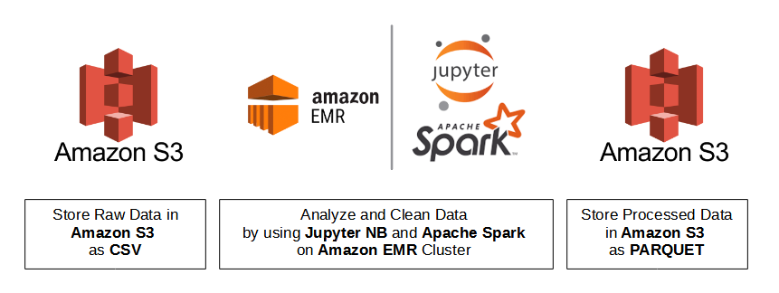

#### Scheduling

In the scheduling process, the processed data in PARQUET format is read from Amazon S3 and staged onto Amazon Redshift PostGreSQL as database tables. Fact and Dimension tables are created on Amazon Redshift and this process is scheduled by Apache Airflow. The following figure shows the process.

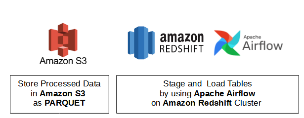

## Data Analysis

### Movies

The content of the data can be examined in [Kaggle Webpage](https://www.kaggle.com/rounakbanik/the-movies-dataset). Sample date is shown below (Transposed).

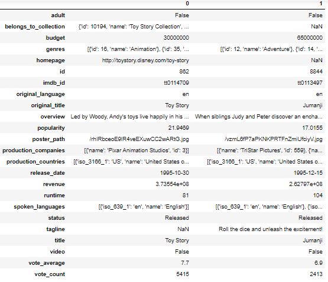

##### Original Columns

The schema of the movies dataset consists of string values. There are lots of irrelevant information in the columns. Also, some information is in JSON format but stored as string in the dataset. In general the following is applied to the data:

-  NULL values in movie_id and imdb_id columns are omitted. Duplicate values in these columns are dropped.
-  Data types are specified. According to this, irrelevant types are converted into NULL values. 
-  The information in JSON format stored as string in the data is extracted and new tables for these information are created.
-  Preprocessing is not applied to all data columns, which are kept as original in the staging tables.

The following table shows the processes applied to the data for corresponding column.

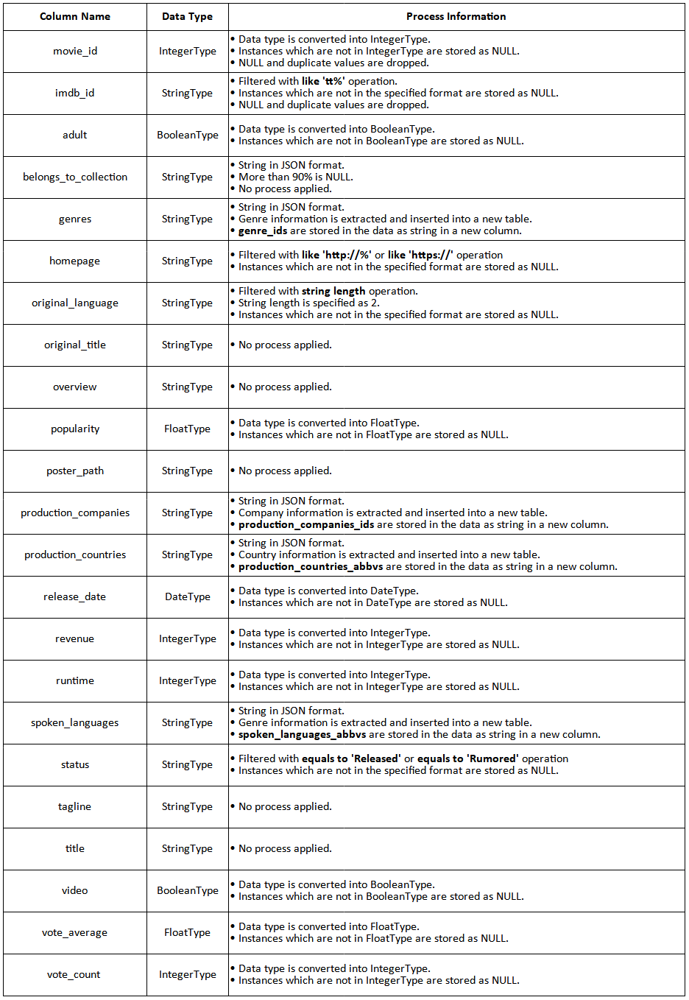

##### Derived Columns

There are six columns derived from the original columns. Explanation of these columns are shown in the figure.

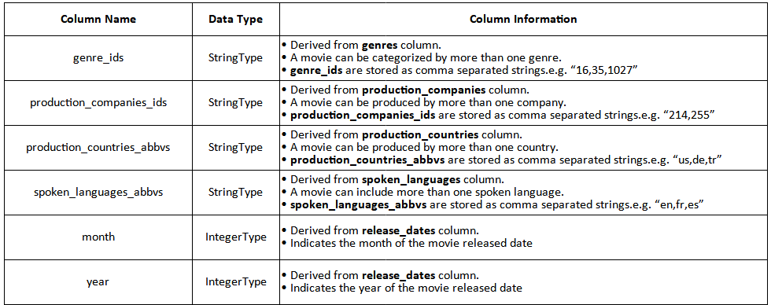

#### Derived Tables

There are four tables derived from the original columns. Explantaions of these tables are shown in the following table.

|    **Table Name**    | **# of Instances** | **# of Columns** |                                                  **Content**                                                 |   |
|:--------------------:|:------------------:|------------------|:------------------------------------------------------------------------------------------------------------:|---|
|        genres        |        93176       | 3                | - Columns are movie_id, genre_id and name.  - Contains genre information of movies.                       |   |
| production_companies |        78458       | 3                | - Columns are movie_id, production_companies_id and name.  - Contains production companies information.   |   |
| production_countries |        55250       | 3                | - Columns are movie_id, production_countries_abbv and name.  - Contains production countries information. |   |
|   spoken_languages   |        56115       | 3                | - Columns are movie_id, spoken_language_abbv and name.  - Contains spoken languages information.          |   |

After these processes, the change in the data schema has shown. 

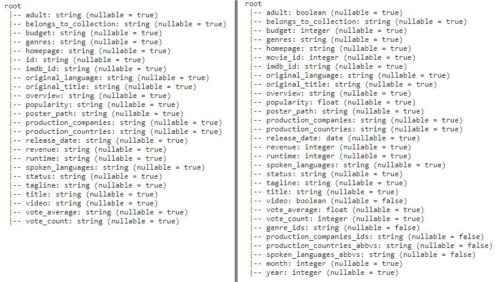

### Ratings

The content of the data can be examined in [Kaggle Webpage](https://www.kaggle.com/rounakbanik/the-movies-dataset). Sample data is shown below.

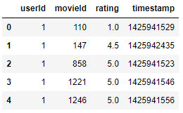

Due to the fact that the data has more than 26 millions records, it is randomly sampled to 5% of its volume, which has 1.3M records. Keeping that size in S3, also transfer the data from Amazon S3 to Amazon Redshift costs. Also, Amazon Redshift has memory issues during joining the tables (There is a need for larger machines -- also costly.)

##### Original Columns

The schema of the ratings dataset is inherited. There are only four columns in the data;therefore, no need to preprocess too many columns. Spark process for ratings data can be examined in [spark](./spark/) folder. In general,

- NULL and duplicated values in user_id and movie_id columns are checked. There were no NULL or duplicated records.
- Rating column is converted into FloatType due to no need of DoubleType for the data. (It has one digit precision.)
- Timestamp column is converted into datetime and appended to data.

##### Derived Columns

There are three columns derived from the original columns. Explanation of these columns are shown in the figure.

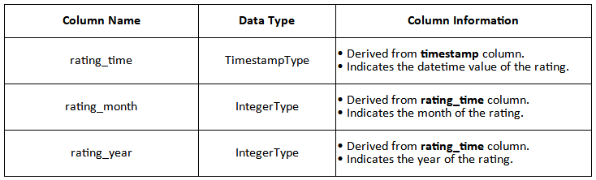

After these processes, the change in the data schema has shown. 

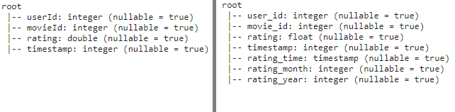

### Storage

There are six data sets stored in Amazon S3 in order to stage in Amazon Redshift. The data is stored in **PARQUET** format.

## Pipeline Scheduling

The processed data is copied to Amazon Redshift. Then, fact and dimension tables are created. The pipeline is scheduled monthly.

### Staging Tables

|        **Table Name**        |                                                                                                                                                                                                **Table Columns**                                                                                                                                                                                                |                         **Content**                         |
|:----------------------------:|:---------------------------------------------------------------------------------------------------------------------------------------------------------------------------------------------------------------------------------------------------------------------------------------------------------------------------------------------------------------------------------------------------------------:|:-----------------------------------------------------------:|
|        staging_ratings       | user_id, movie_id, rating, timestamp, rating_time, rating_month, rating_year                                                                                                                                                                                                                                                                                                                                    | Rating records of user-movie pairing. Contains 1.3M records |
|        staging_movies        | movie_id, imdb_id, adult, belong_to_collection, budget, genres, homepage,  original_language, original_title, overview, popularity, poster_path,  production_companies, production_countries, release_date, revenue, runtime,  spoken_languages, status, tagline, title, video, vote_average, vote_count, genre_ids,  production_companies_ids, production_countries_abbvs, spoken_languages_abbvs, month, year | Contains movie information.                                 |
|        staging_genres        | movie_id, genre_id, name                                                                                                                                                                                                                                                                                                                                                                                        | Contains genre information.                                 |
| staging_production_companies | movie_id, production_companies_id, name                                                                                                                                                                                                                                                                                                                                                                         | Contains company name information.                          |
| staging_production_countries | movie_id, production_countries_abbv, name                                                                                                                                                                                                                                                                                                                                                                       | Contains country name information.                          |
| staging_spoken_languages     | movie_id, spoken_languages_abbv, name                                                                                                                                                                                                                                                                                                                                                                           | Contains spoken language information.                       |

### Fact & Dimension Tables

|    **Table Name**    |                                                                                 **Table Columns**                                                                                | **Table Design** |                  **Content**                  |
|:--------------------:|:--------------------------------------------------------------------------------------------------------------------------------------------------------------------------------:|------------------|:---------------------------------------------:|
|  user_movie_ratings  | user_id, movie_id, rating_time, release_date, genre_id_1,  genre_id_2, prod_company_id_1, prod_company_id_2, prod_country_abbv_1,  prod_country_abbv_2, spoken_lang_abbv_1, spoken_lang_abbv_2  | Fact             | Fact Table for the user-movie ratings         |
|        movies        | movie_id, imdb_id, budget, adult, homepage, original_language,  original_title, title, overview, popularity, runtime, revenue,  status, tagline, video, vote_average, vote_count | Dimension        | Contains movie information of each movie.     |
|        ratings       | user_id, movie_id, rating_time, rating                                                                                                                                           | Dimension        | Contains rating information.                  |
|     rating_times     | rating_time, rating_year, rating_month, rating_day, rating_hour, rating_week, rating_weekday                                                                                     | Dimension        | Contains rating time information.             |
|     release_dates    | release_date, release_year, release_month, release_day, release_week, release_weekday                                                                                            | Dimension        | Contains movie release date information.      |
|   spoken_languages   | lang_abbv, lang_name                                                                                                                                                             | Dimension        | Contains spoken language name information.    |
|        genres        | genre_id, genre_name                                                                                                                                                             | Dimension        | Contains genre name information.              |
| production_countries | country_abbv, country_name                                                                                                                                                       | Dimension        | Contains production country name information. |
| production_companies | company_id, company_name                                                                                                                                                         | Dimension        | Contains production company name information. |

The following schema shows the connection between fact and dimension tables.

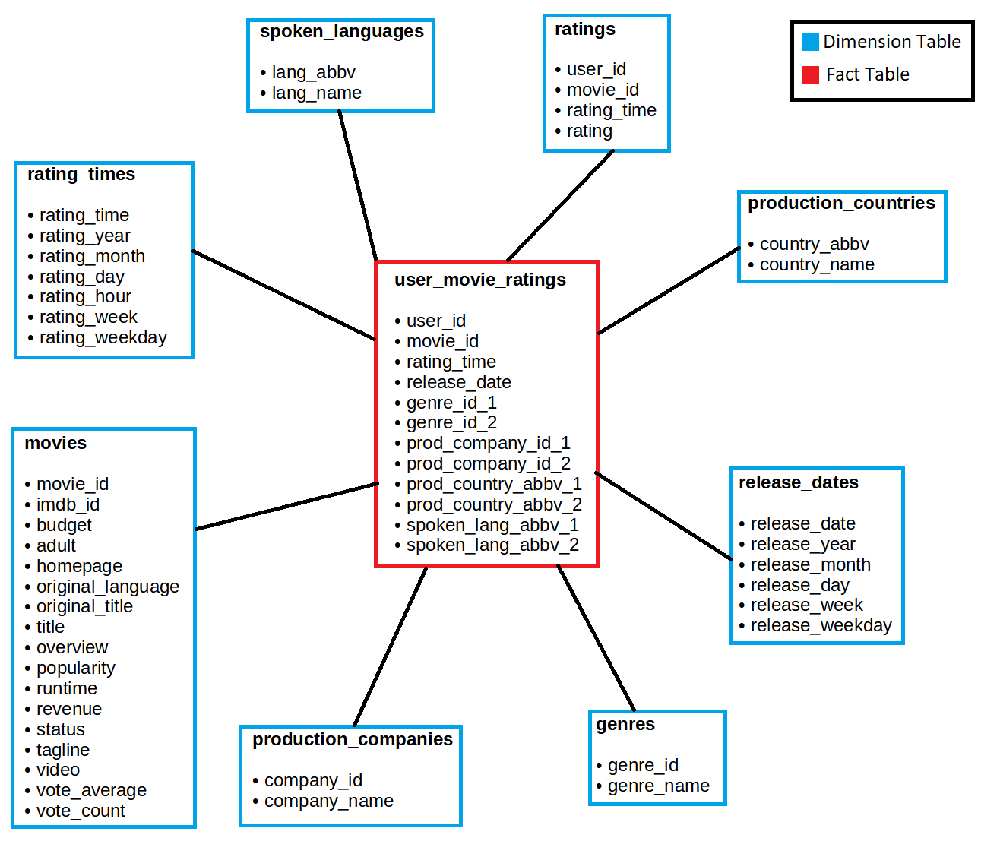

### Operators & DAG

In this project, we used 6 different operators:

- **CreateTablesOperator:** Creates tables if they do not exist.
- **StageToRedshiftOperator :** Copies the data from S3 Bucket to Amazon Redshift.
- **LoadFactOperator:** Loads the fact table records to the related fact tables.
- **LoadDimensionOperator:** Loads the dimension table records to the related dimension tables.
- **DataQualityOperator:** Check the table has records in the end of the process.
- **DummyOperator:** Indicates the process has started and completed.

#### ETL Process

- **Create_tables:** Creates all tables.

- **Stage_movies, Stage_genres, Stage_production_countries, Stage_production_companies, Stage_spoken_languages, Stage_ratings:** Copy data from Amazon S3 to Amazon Redshift.
- **Load_movies_dim_table, Load_genres_dim_table, Load_production_countries_dim_table, Load_production_companies_dim_table, Load_spoken_languages_dim_table, Load_release_dates_dim_dates, Load_ratings_dim_table, Load_rating_times_dim_table:** Load dimension tables.

- **Load_user_movie_ratings_fact_tables:** Load fact table.

- **Run_staging_quality_checks, Run_dimension_table_quality_checks, Run_fact_table_quality_checks:** Run quality check for staging_tables, dimension_tables and fact table.

The completed DAG is shown in the following figure:

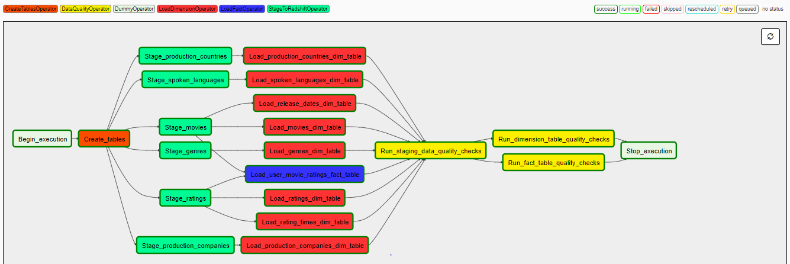

## How to Run

- Upload data to Amazon S3.
- Create an Amazon EMR Cluster.
- Run the analysis codes on the cluster
- Write the processed data to S3.
- Create an Amazon Redshift Cluster. 
- On Airflow Interface Page >> Admin >> Connections, create AWS and Redshift connections with the names "aws_credentials" and "redshift". 
- Run the DAG. During the operation, the tree view will be as the following figure:

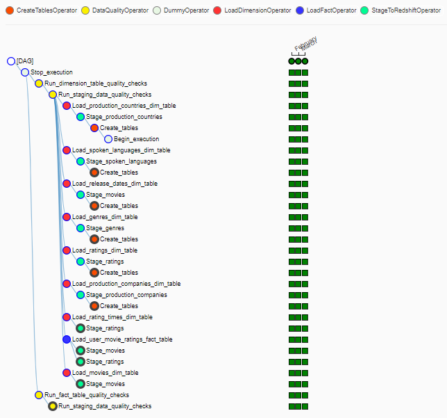

The DAG Timeline is shown in the figure:

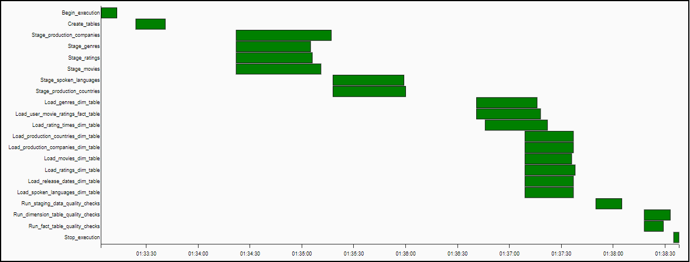

##### Final Sample on Redshift

The final data sample is shown below. [Samples](./redshift_final_samples/) can be seen in redshift_final_samples folder.

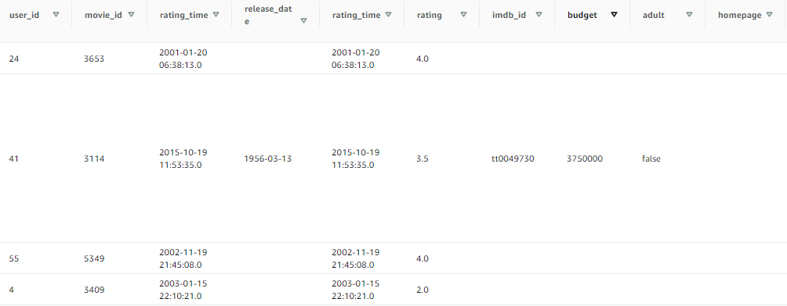

## Possible Scenarios

- **If the data was increased by 100x :** Then, all the process should be run on EMR Cluster by using Apache Spark. Actually, fact and dimension tables can also be created on Spark due to save Amazon Redshift and Amazon S3 storage.

- **If the pipelines were run on a daily basis by 7am:** Then, schedule interval should be change to daily.

- **If the database needed to be accessed by 100+ people:** There are two ways: First, carrying all the process to Spark and loading only fact and dimension tables. Second, scaling up the Amazon Redshift clusters. 
