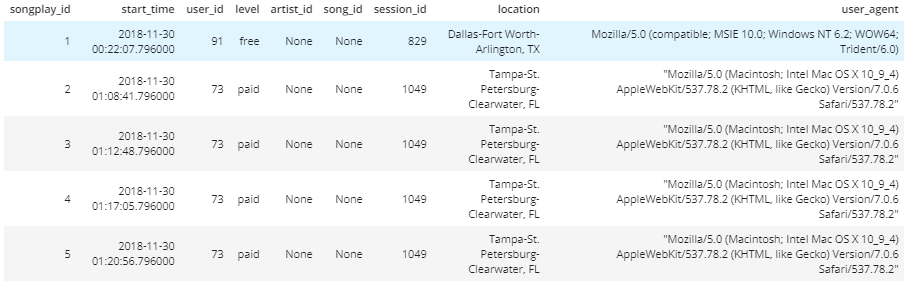
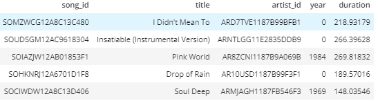
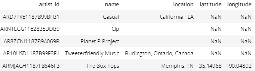
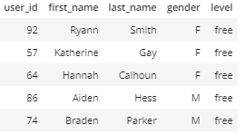
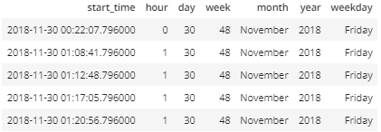

# Data Modeling with PostGreSQL

### Introduction

Sparkify is a company providing streaming music through the application. The data they've been collecting on songs and user activity is available in JSON format. As the data size increases, to query and analyze the data becomes more difficult. The aim of this project is to create a database schema and ETL pipeline for processing and analyzing the data.

STAR schema design is used in this project. The design consists of one fact table and several dimension tables.

- **Fact Table:** songplays table.
- **Dimension Tables:** users, songs, artists and time table.

As example, the following analysis can be made by using the tables:

- The most listened song hourly, daily, weekly, monthly etc. -- by joining songplays, songs and time tables
- The most listened artists among the men or women, free or paid etc. -- by joining songplays, artists and users tables
- Viral musics, behaviors of users, artists popularity recently etc. -- by combining all tables

### ETL

For ETL process, there are two main folders where the data available: songs and logs. 

- **Songs:** In JSON format and contains metadata about a song and the artist of that song.
- **Logs:** In JSON format and contains user activity logs from a music streaming app based on specified configurations.

After extracting the data: 
- Created **songs, artists** tables from songs_data.
- Created **users, time** tables from log_data.
- Created **songplays** table by using mostly log data and id columns of songs and artists tables.

### File Details

- **sql_queries.py** contains all the necessary queries to create, drop, insert and select.
- **create_tables.py** creates the database and also tables by using sql_queries.py file. If the tables exist, it drops them.
- **etl.py** runs the etl pipeline. It gets the data in JSON format and inserts it into the relevant tables.

- **etl.ipynb** is the notebook to work on the ETL pipeline. In the end, the scripts are copied to etl.py.
- **test.ipynb** is the notebook to check if a process is completed or not by checking the table contents.

### Libraries

In this project, several libraries are used: 

- **os:** Used for file operations
- **glob:** Used for file operations
- **psycopg2:** Used for PostgreSQL operations
- **pandas:** Used for data operations
- **sql_queries:** Custom file. Used for SQL query operations.

### Usage

1. Run the terminal.
2. In the terminal, run **python create_tables.py** to drop existing tables and create new ones.
2. In the terminal, run **python etl.py** to extract information from JSON files, transform into tables and load to database and related tables.

## Test

In the end, the final tables should be as following:

##### Songplays Table

##### Songs Table

##### Artists Table

##### Users Table

##### Time Table

