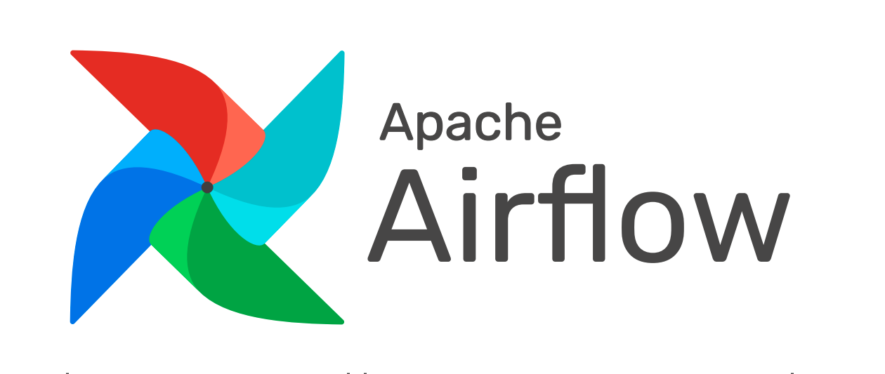
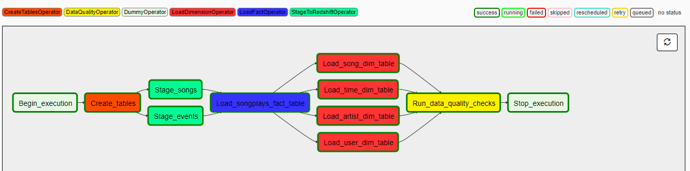

# Data Pipelines with Airflow

## Introduction

Sparkify, which is a streaming music start-up, wants to automate their ETL pipeline with airflow.
The data is in S3 Bucket, as log and song data. Datasets are in JSON metadata format.
In this project, we will automate an ETL pipeline with Airflow. First, we will create the tables on Amazon Redshift, then copy data from S3 Bucket to Amazon Redshift. Then, we will insert the data to Amazon Redshift tables and check the data. Finally, we will run this process every hour.

## Dataset

Sparkify has two different dataset on AWS S3 Bucket: Song & Log Data.

- **Song Dataset:** 
    - This dataset is a small sample of real data from [Million Song Dataset](http://millionsongdataset.com/). The files are in JSON format and contains song, artist and duration info.
    - The song data folder has a structure as the following: __song_data/\*/\*/\*/song_id.json__ in JSON format.
        - Example: song_data/A/A/B/TRAABJL12903CDCF1A.json
    - The dataset is located on __"s3://udacity-dend/"__
    
- **Log Dataset:** 
    - This dataset contains the user activities. Each event is logged as JSON format and contains user information. 
    - The log data folder has a structure as the following: __log_data/\<year>/\<month>/\<date>-events.json__ in JSON format.
        - Example: log_data/2018/11/2018-11-13-events.json
    - The dataset is located on __"s3://udacity-dend/"__
    

### Staged Tables
| Table Name | Table Columns                                                                                 | Tabel Design | Explanation                                                 |
|------------|-----------------------------------------------------------------------------------------------|--------------|-------------------------------------------------------------|
| staging_events  | artist, auth, firstname, gender, iteminsession, lastname, length, level, location, method, page, registration, sessionid, song, status, ts, useragent, userid | Raw Table       | Raw records in the event data associated with the played songs. |
| staging_songs      | song_id, title, artist_id, year, duration                                                     | Raw Table    | Raw records in the song data associated with the songs in the inventory.                                       |

### Loaded Tables

| Table Name | Table Columns                                                                                 | Tabel Design | Explanation                                                 |
|------------|-----------------------------------------------------------------------------------------------|--------------|-------------------------------------------------------------|
| songplays  | songplay_id, start_time, user_id, level, song_id, artist_id, session_id, location, user_agent | Fact         | Records in the event data associated with the played songs. |
| songs      | song_id, title, artist_id, year, duration                                                     | Dimension    | Contains song info.                                         |
| artists    | artist_id, name, location, latitude, longitude                                                | Dimension    | Contains artist info.                                       |
| users      | user_id, first_name, last_name, gender, level                                                 | Dimension    | Contains user info.                                         |
| time       | start_time, hour, day, week, month, year, weekday                                             | Dimension    | Contains time info.                                         |
  
## Operators & DAG

In this project, we used 6 different operators:

- 1. **CreateTablesOperator:** Creates tables if they do not exist.
- 2. **StageToRedshiftOperator :** Copies the data from S3 Bucket to Amazon Redshift.
- 3. **LoadFactOperator:** Loads the fact table records to the related fact tables.
- 4. **LoadDimensionOperator:** Loads the dimension table records to the related dimension tables.
- 5. **DataQualityOperator:** Check the table has records in the end of the process.
- 6. **DummyOperator:** Indicates the process has started and completed.

The completed DAG is shown in the following figure:

## How to Run

- 1. Create an Amazon Redshift Cluster. 
- 2. On Airflow Interface Page >> Admin >> Connections, create AWS and Redshift connections with the names "aws_credentials" and "redshift". 
- 3. Run the DAG. On the operation, the tree view will be as the following figure:

